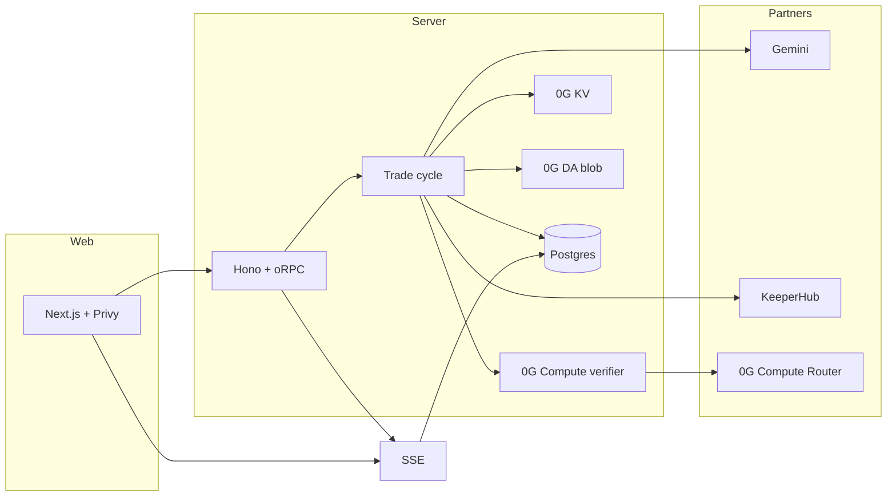

# auto.eth

Auto deploys autonomous AI trading vaults on Base. Instead of trusting a centralized backend, every decision is cryptographically audited. An LLM proposes a trade, **0G Compute** verifies the risk parameters, **KeeperHub** executes the swap on-chain, and the entire thought process is permanently logged to **0G Storage** (**KV** + **DA**). Verifiable intent, zero black boxes.

---

## Demo checklist (fill in for submissions)


|                     |                                                                                   |
| ------------------- | --------------------------------------------------------------------------------- |
| **Live demo**       | *Your deployed URL*                                                               |
| **Short video**     | *Link* — e.g. intro → run cycle → logs/diagnostics → activity row showing KV + DA |
| **Example swap tx** | *Basescan link on Base Sepolia (or mainnet)*                                      |


---

## What this is

auto is a small product slice: users sign in, manage vaults, and trigger trade cycles manually or on a schedule. Each cycle produces a structured record (proposal, risk outcome, optional execution). The web app stays fast because we cache that history in Postgres and stream updates over SSE; the durable audit trail is written to **0G Storage** in two complementary ways—**KV** for nimble stream state and **DA** blobs for a full JSON trace per cycle.

---

## Why we built it this way

- Trust and demos: A dashboard that only reads Postgres is hard to defend in a decentralized stack. We wanted verifiable storage patterns (**KV** + file-style **DA**) and a named inference step on **0G Compute** so the story is easy to follow: *propose → check → verify → execute → prove on 0G*.
- Speed vs durability: Blockchains and storage networks aren’t instant. Postgres + SSE give a responsive UI; background jobs finish KV/DA writes and patch the same row when proofs arrive so the activity card updates without blocking the HTTP response.
- One codebase: Everything runs in a monorepo (Next.js + Hono) so judges and contributors can grep from the README table straight into the implementation.

---

## How it works (human version)

1. Suggest — Gemini outputs a strict JSON trade proposal using recent trading memory (prior cycles), plus your vault rules.
2. Gate — Deterministic risk checks run first (allowlists, sizing, and similar).
3. Verify — If the gate passes, a **0G Compute** Router call acts as a verifier stage: it sees the same memory and the proposal in separate prompt blocks, and returns an approve/reject verdict.
4. Execute (optional) — If policy allows and risk is green, the server builds **Uniswap** calldata and submits the swap via **KeeperHub** to the user’s vault on Base.
5. Record — The cycle is saved for the UI, then **KV** and (by default) a **DA** trace blob are written in the background; the UI shows pointers, batch roots, and tx links when they land.

If you’re skimming for integrations, the next section maps each of those steps to docs, code, and env.

---

## Integration map (skim this)

Note: All builder feedback (**0G**, **Uniswap**, **KeeperHub**, **ENS / Basenames**) is in [`FEEDBACK.md`](./FEEDBACK.md).

Each row is something you can run, click, or grep in the repo.


| Capability                 | 0G / stack                                                                                        | Try it                                                                                                          | Where in code                                                                                                                                                 |
| -------------------------- | ------------------------------------------------------------------------------------------------- | --------------------------------------------------------------------------------------------------------------- | ------------------------------------------------------------------------------------------------------------------------------------------------------------- |
| Verifier on **0G Compute** | [Compute Router](https://docs.0g.ai/developer-hub/building-on-0g/compute-network/router/overview) | Turn off mocks, set a Router API key, run a cycle; logs show `verifier stage start` → `verifier stage verdict`. | `[og-compute-verifier.ts](./apps/server/src/integrations/og-compute-verifier.ts)` · `[og-compute-risk.ts](./apps/server/src/integrations/og-compute-risk.ts)` |
| Memory fed into verifier   | Same entries as Gemini                                                                            | Set `DEBUG=true` and watch `memoryEntries` on verifier start.                                                   | `[trading-memory-source.ts](./apps/server/src/services/trading-memory-source.ts)` · `[run-trade-cycle.ts](./apps/server/src/router/run-trade-cycle.ts)`       |
| **KV** audit trail         | [Storage SDK — KV](https://docs.0g.ai/developer-hub/building-on-0g/storage/sdk)                   | Open a vault → Recent activity → audit block: stream pointer, KV batch root, batch tx.                          | `[og-logger.ts](./apps/server/src/integrations/og-logger.ts)` · `[og-cycle-log-queue.ts](./apps/server/src/services/og-cycle-log-queue.ts)`                   |
| **DA** full trace blob     | [Storage SDK — upload](https://docs.0g.ai/developer-hub/building-on-0g/storage/sdk) (`MemData`)   | Same card: DA trace root and DA blob tx (optional: `OG_DA_CYCLE_TRACE=false` to skip).                          | `[og-cycle-da-blob.ts](./apps/server/src/integrations/og-cycle-da-blob.ts)`                                                                                   |
| Live UI                    | Postgres + SSE                                                                                    | Scroll activity; proofs can appear shortly after the cycle returns 200.                                         | `[cycle-stream.ts](./apps/server/src/router/cycle-stream.ts)` · `[use-vault-cycle-feed.ts](./apps/web/src/app/vaults/[id]/use-vault-cycle-feed.ts)`           |
| Swaps                      | Base + **KeeperHub** + **Uniswap**                                                                | Live mode: cycle returns a swap `txHash`; UI links to Basescan.                                                 | `[keeperhub-client.ts](./apps/server/src/integrations/keeperhub-client.ts)` · `integrations/` (Uniswap builder)                                               |
| **ENS** (identity)         | [ENS](https://docs.ens.domains/) — resolution on **Ethereum mainnet**                               | Connect a wallet with a primary `.eth` name (and optional `avatar` record); account menu + cycle logs pick it up. | `[ens-operator-snapshot.ts](./apps/server/src/integrations/ens-operator-snapshot.ts)` · `[use-operator-ens.ts](./apps/web/src/hooks/use-operator-ens.ts)` · `[user-dropdown.tsx](./apps/web/src/components/user-dropdown.tsx)` |


TypeScript SDK used here: `[@0gfoundation/0g-ts-sdk](https://www.npmjs.com/package/@0gfoundation/0g-ts-sdk)`

Handy links


|                            |                                                                                                  |
| -------------------------- | ------------------------------------------------------------------------------------------------ |
| Storage explorer (Galileo) | [storagescan-galileo.0g.ai](https://storagescan-galileo.0g.ai) (also `OG_STORAGE_EXPLORER_BASE`) |
| Testnet keys / credits     | [pc.testnet.0g.ai](https://pc.testnet.0g.ai/)                                                    |
| ENS manager (register / profile) | [app.ens.domains](https://app.ens.domains)                                                 |


---

## ENS (identity)

ENS integration is **read-only** and **best-effort**: we never block vault flows on name resolution.

- **Chain:** All ENS reads use **Ethereum L1** (ENS’s home chain), via viem `getEnsName` → `normalize` → `getEnsAvatar`, consistent with [ENS docs](https://docs.ens.domains/web/quickstart). Vaults and swaps stay on **Base** (e.g. Sepolia in dev).
- **Wallet vs in-app agent name:** The **agent name** you set when creating or editing a vault is stored in our DB only. A public **`.eth` primary name** and **avatar** belong to the **operator wallet** (the user’s `primary_wallet_address`). Register or update those in [ENS manager](https://app.ens.domains); the app does not sell or mint names.
- **Where it shows up:**
  - **Account menu** — primary name and avatar on the trigger (when present), a one-line note that ENS is L1 and vaults are on Base, and a link to **Register / manage ENS**.
  - **Trade cycles** — Each new cycle may include an optional `operatorEns` snapshot (`primaryName`, `avatarUrl`) on the persisted `CycleLogRecord` for audit/UI; older rows omit it.
- **Optional env:** `ETH_MAINNET_RPC_URL` (server) and `NEXT_PUBLIC_ETH_MAINNET_RPC_URL` (web) override the default public mainnet RPC; see `[packages/env](./packages/env)` and `[apps/server/.env.example](./apps/server/.env.example)`.

### Basenames (`*.base.eth`) and vault agents

We **verify** optional **`*.base.eth`** names against the **vault contract address** (forward resolution on Base) and store a normalized link in the agent profile. **Reverse** display in the UI relies on a **primary** name for that address (ENSIP-19 via mainnet resolver + chain `coinType`); **transferring** a name to the vault does **not** by itself set **primary**, and the Basenames flows we used did not give us a clear way to set **primary for a smart contract** the way ENS manager does for EOAs. We therefore often fall back to the **DB-linked** name after a successful save, not automatic on-chain reverse.

For **partner-facing ENS / Basenames notes** (use case, primary-name gap, L2 economics, wishlist), see **[`FEEDBACK.md`](./FEEDBACK.md)** — **ENS & Basenames — builder feedback**.

---

## The Execution Pipeline




In one sentence: Postgres and SSE keep the app snappy; **0G Storage** uses **KV** for stream-shaped audit keys and **DA** for a full JSON envelope per cycle. Expect two storage-related txs when both paths are on (KV batch + DA upload).

---

## Run it locally

You’ll need [Bun](https://bun.sh/), a Postgres URL, and the keys listed under [Environment](#environment) (start from the example file).

```bash
bun install
cp apps/server/.env.example apps/server/.env.staging   # or .env.local
# Fill in secrets, then:
bun run web:dev
```

- Frontend: [http://localhost:3001](http://localhost:3001)  
- API: [http://localhost:3000](http://localhost:3000) — set `NEXT_PUBLIC_SERVER_URL` in the web app to match.

Quick sanity check

1. Sign in with Privy and open a vault.
2. Run a trade cycle (dry-run or live, depending on your env).
3. Under Recent activity, open Audit trail · 0G Storage and confirm pointer / KV / DA fields as jobs finish.
4. Optional: `GET /diagnostics` on the API for a short health summary.
5. Optional: use a wallet with a **primary ENS name** on mainnet — the account menu and new cycle rows should show name/avatar when resolution succeeds.

Repo hygiene

```bash
bun run check
bun run check-types
```

---

## Environment


| Area           | What you need                                                                                             | Tip                                                          |
| -------------- | --------------------------------------------------------------------------------------------------------- | ------------------------------------------------------------ |
| Core app       | `DATABASE_URL`, `CORS_ORIGIN`, Privy, deploy secrets                                                      | See `[apps/server/.env.example](./apps/server/.env.example)` |
| LLM            | `GEMINI_API_KEY`, `GEMINI_MODEL`                                                                          | `MOCK_LLM=true` skips Gemini for local experiments           |
| **0G Storage** | `OG_RPC_URL`, `OG_INDEXER_RPC`, `OG_KV_ENDPOINT`, `OG_PRIVATE_KEY`, `OG_FLOW_CONTRACT`, `OG_KV_STREAM_ID` | Fund the signer for both **KV** and **DA** if DA is enabled  |
| DA traces      | `OG_DA_CYCLE_TRACE`                                                                                       | Default on; set `false` to skip blob uploads                 |
| **0G Compute** | `OG_COMPUTE_ROUTER_API_KEY`                                                                               | Required for a real verifier unless `MOCK_RISK_AGENT=true`   |
| Execution      | `KEEPERHUB_`*, `UNISWAP_ROUTER_ADDRESS`, chain RPC                                                        | `MOCK_EXECUTION=true` fakes a successful swap                |
| Web            | `NEXT_PUBLIC_SERVER_URL`                                                                                  | Must point at your API                                       |
| **ENS** (optional) | `ETH_MAINNET_RPC_URL`, `NEXT_PUBLIC_ETH_MAINNET_RPC_URL`                                            | Override L1 RPC for `getEnsName` / `getEnsAvatar` (browser RPCs can be rate-limited) |

More detail (internal): `docs/integrations.md` and `packages/env`.

---

## Repository layout

```
auto/
├── apps/web/          # Next.js — vault UI, SSE client
├── apps/server/       # Hono + oRPC — cycles, 0G, KeeperHub, scheduler
├── packages/api/      # Shared types and RPC contracts
├── packages/env/      # Validated env for server and web
├── packages/ui/       # Shared UI primitives
└── docs/              # Deeper notes (overview, integrations, roadmap)
```

Further reading: [`FEEDBACK.md`](./FEEDBACK.md)

---

## Stack & scripts

Stack: TypeScript, Turborepo, Bun, Next.js, Hono, oRPC, Drizzle + Postgres, `@0gfoundation/0g-ts-sdk`, Biome (Ultracite). Bootstrapped from [Better-T-Stack](https://github.com/AmanVarshney01/create-better-t-stack).


| Command                                  | Purpose                                 |
| ---------------------------------------- | --------------------------------------- |
| `bun run web:dev`                        | API + web (typically ports 3000 / 3001) |
| `bun run dev:web` / `bun run dev:server` | Run one side only                       |
| `bun run build`                          | Production build                        |
| `bun run check`                          | Lint + format                           |
| `bun run check-types`                    | Typecheck the monorepo                  |


---

## Security

Do not commit real `.env` files or private keys. Treat `OG_PRIVATE_KEY`, `KEEPERHUB_API_KEY`, `GEMINI_API_KEY`, and `OG_COMPUTE_ROUTER_API_KEY` as server-only secrets.
